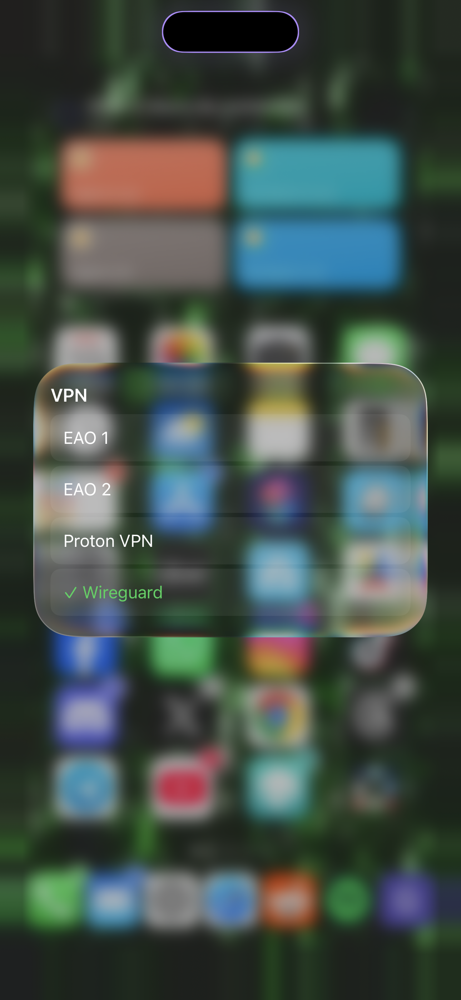

# BetterCCVPN

A Control Center module to switch and connect VPNs without leaving Control Center. Tap the tile to toggle the selected VPN on/off; hold it to expand a list of every VPN configured on the device (personal, enterprise, and app-based) and pick a different one, with a checkmark on whichever is currently selected.



## Tested Environment

- iPhone 14 Pro Max (iPhone15,3)
- iOS 16.6.1
- roothide Bootstrap (rootless jailbreak)

Other devices and iOS versions are untested and not yet supported.

## Installation

Add this repo to Sileo/Zebra: https://brkr1.github.io/repo/

Or grab the latest `.deb` from [Releases](../../releases) and install manually. Requires [CCSupport](https://github.com/opa334/CCSupport) and adding the module in Control Center settings.

## Building from source

Requires [Theos](https://theos.dev). CI builds with GitHub Actions on macOS (see `.github/workflows/build.yml`) using the real Xcode toolchain. arm64e builds need this specifically, since clang's class_ro pointer signing on arm64e isn't always read back correctly by libobjc, and can crash the injected process silently if built with the wrong toolchain.

```sh
make package THEOS_PACKAGE_SCHEME=rootless
```

## Support

If you like my tweaks, consider buying me a coffee:

<a href="https://buymeacoffee.com/brkr1" target="_blank"></a>

## Credits

Original idea and the classic single-VPN Control Center toggle by [u/KingPuffdaddi](https://www.reddit.com/user/KingPuffdaddi/) (CCVPN). BetterCCVPN is a from-scratch rebuild adding a real multi-VPN picker, built on top of the private `VPNController`/`VPNConnectionStore` APIs behind Settings' own VPN screen.
